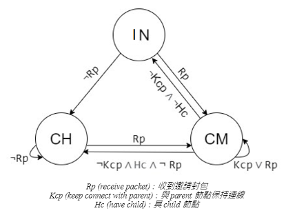
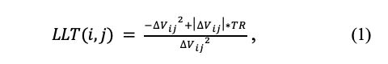
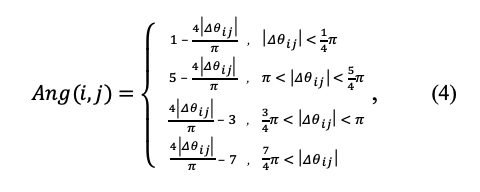
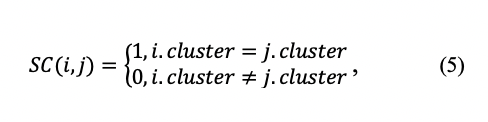
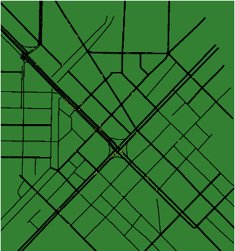
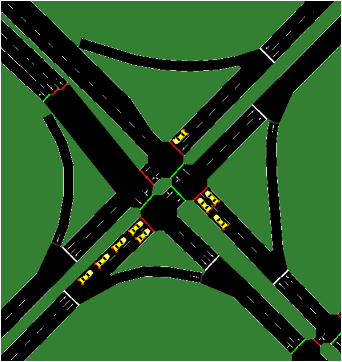
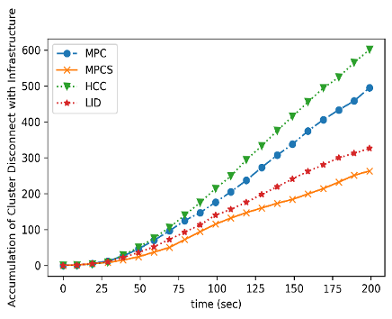
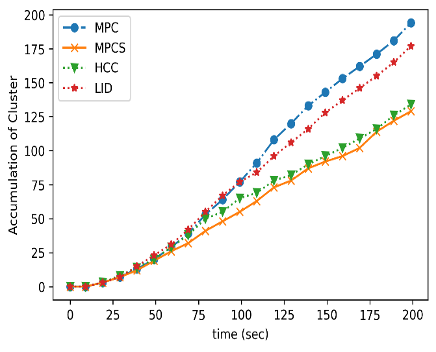
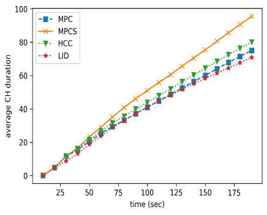
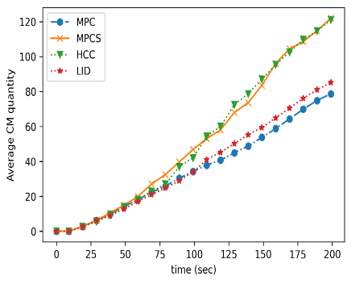

# 多跳車載網路叢集之貪婪演算法
## Multi-hop VANET-Clustering Algorithm Using Greedy Method
<hr>


# 緒論
> > 欲透過車輛隨意網路(Vehicular Ad Hoc Net-work, VANET)提供服務，即時且高效的通訊系統是必須的，而目前通訊方式主要分為車輛對基礎設施(Vehicle-to-Infrastructure)，與車輛對車輛(Vehicle-to-Vehicle)[1][2]，其中兩者如何調配是值得考慮的，若所有車輛都直接與基礎設施通訊，基礎設施接收訊號時會受到大量干擾與過多的冗餘資訊，因此鄰近車輛若能將彼此行車資訊整理後，再由指定車輛與基礎設施進行通訊，則可降低資訊冗餘提昇通訊品質。
> >
> > 由於行車的高機動性與分佈不均性，建立穩定的通訊管理十分不易，然而叢集方法已被證明於提高可靠性及擴展性具有相當的成效[4]。叢集由一個叢集首負責管理叢集內成員的通信，並且由其負責與基礎設施和其他叢集首溝通，然而最初的叢集方法是針對移動隨意網路(mobile ad hoc network, MANET)而設計，對於行車的移動快速、變動的拓撲、限制的移動、極高的延伸性、節點間的易斷線性等[5]原因，原本於移動隨意網路的叢集演算法，必須根據其特性進行調整。本文將提出一個基於貪婪演算法(Greedy Algorithm)與階層式架構(Hierarchical Structure)以降低進行叢集所帶來的額外負擔，並以最大預測連線存活演算法(Maximum Predicted Connection Survival time algorithm, MPCS)，作為節點進行各項叢集活動的量化指標。
> >
> ## 本文貢獻
> > 1. 使用階層式架構達到一定的分散性，降低CH與CM間因叢集所帶來的額外傳輸成本
> > 2. 提出基於連線存活時間與行徑方向的量化指標，作為節點狀態改變及叢集挑選的依據
> > 3. 藉由定時叢集挑選，使節點與節點間保持最佳連線狀態
> > 4. 叢集首定時測試與叢集成員之連線，以維護叢集整體連線品質
> >  

# 系統模型
> 我們的系統模型中假設每輛車具有唯一的身分識別碼(Identity Code, ID)並配備車載單元(Onboard Unit, OBU)，可以由全球定位系統(Global Position-ing System, GPS)獲取當前位置、速率與移動方向。本文使用之符號列於 表 1
> > - 表 1 符號表
> >  
> >  符號 | 定義
> >  |:-:|:-:|
> >  Tcollect | 計時器，期間車輛會傳輸及接收封包，並於到期時進行MPCS演算法
> >  Ci | 車輛i之識別碼
> >  State(i) | 車輛i的狀態
> >  Δx | 兩車的x座標距離差
> >  Δy | 兩車的y座標距離差
> >  ΔVx | 兩車的x方向速度差
> >  ΔVy | 兩車的y方向速度差
> >  Δθ | 兩車的行徑方向角度差
> >  TR | 最大封包傳遞範圍
> >  Clu(i) | 車輛i所在叢集編號
> >  Layer(i) | 車輛i所在叢集層數
> >  Pd | 於Tcollect期間接收失敗封包紀錄
> >  PCM | 於Tcollect期間接收CM車輛的封包
> >  PCH | 於Tcollect期間接收CH車輛的封包
> 
> 每輛車將被賦予一個狀態，分別為：初始節點(Initial Node, IN)、叢集成員(Cluster Member, CM)叢集首(Cluster Header, CH)並於Tcollect到期後於特定事件發生下轉換狀態
> 
> 如圖 1所示。其中CM分為parent與child，parent負責將自身與children的行車資訊向CH方向傳遞，此階層式架構能達到分散化所帶來的效果，每個parent只需要維護自己one-hop範圍內的children，節點的加入與退出都不需要經由CH認可，只需要與parent建立連線，此法可極大地降低與CH藉由multi-hop的通訊，且當parent因更換parent而更換叢集時也不必通知children。
> > - 圖 1 節點狀態轉換表
> >
> > 

# 車輛叢集
> 所有節點初始狀態皆為IN，節點開始移動前進行一次Tcollect，計時過程中進行接收邀請封包，內容列於表 2 :
> - 表 2 封包內容
> 
> 符號 | 定義
> |:-:|:-:|
> Time | 封包送出時間
> Ci | 車輛編號
> X | 車輛所在經度
> Y | 車輛所在緯度
> Vx | 東西向速度
> Vy | 南北向速度
> Layer(i) | 所在叢集層數
> State(i) | 車輛狀態
> Upper_LLT(i) | 車輛i的ancestor間平均LLT
> NodeNum(i) | 目前叢集成員數量
> 
> 當車輛Tcollect到期，即進行最大預測連線存活時間(Maximum Predicted Connection Survival time algorithm, MPCS) 演算法 1，其中車輛會根據自身狀態、PCM 、PCH與Pd進行不同決策
> 
> 若車輛的狀態為IN，於Tcollect過程中有接收到來自其他車輛的邀請封包，進行叢集挑選(Cluster Selection, CS)演算法(2)，選出具有最大預測連線數值的車輛與其連線，加入此叢集，並將自身狀態更新為CM，若沒有接收到任何邀請封包代表附近沒有已存在之叢集可加入，則建立新的叢集與基礎設施建立連線，並更換狀態為CH。
> 
> 若車輛狀態為CM，且Tcollect期間收到來自CM或CH的封包，進行叢集挑選(SC)演算法(2)挑選出最適合的newParent，如果newParent不是目前的parent，則與原本的parent斷開連線並與newParent連線，加入newParent所在叢集，否則保持與原parent的連線，如此車輛能保持與最合適的parent連線，CH也不必特別對連線不佳而影響到整體叢集品質的CM做維護。若期間沒有收到parent的封包，也沒有收到其他叢集的邀請封包，代表此子叢集已脫離主叢集，則建立新的叢集，改變狀態為CH，並與基礎設施建立連線。
> 
> 若車輛狀態為CH，且期間有收到來自其他叢集的邀請封包，將經過叢集挑選(SC) 演算法 2 挑選出最適合的newParent，若判斷合併後不超出叢集最大成員限制、層數限制，則進行Upper_LLT比較，由具有較小Upper_LLT的節點向另一節點合併，並將加入節點狀態更改為CM。
> 
> > - 演算法 1 最大預測連線存活時間 (Maximum Predicted Connection Survival time algorithm, MPCS)
> > ```
> > IF C.Tcollect is Time Up OR Force THEN
> >     IF C.state is “IN” THEN
> >         IF C receive pak from other cars THEN
> >             LET newParent_list TO CS(C)
> >             FOR newParent IN newParent_list DO
> >                 IF two clusters could be merge THEN
> >                     CAR_CONNECT(C, newParent)
> >                     C join newParent.cluster
> >                     C change state to CM
> >                     LET join_flag TO TRUE
> >                     BREAK
> >                 END IF
> >             END FOR
> >         ELSE
> >             LET newClu TO CLUSTER_CREATE(C)
> >             C join newClu
> >             C change state to CH
> >         END IF
> > 
> >     ELSE IF C.state is “CM” THEN
> >         IF C receive any pak THEN
> >             LET newParent_list TO CS(C)
> >             FOR newParent IN newParent_list DO
> >                 IF two clusters could be merged AND newParent is not C.child THEN
> >                     CAR_DISCONNECT(C, parent)
> >                     CAR_CONNECT(C, newParent)
> >                     C join newParent.cluster
> >                 END IF
> >             END FOR
> >         ELSE
> >             LET newClu TO CLUSTER_CREATE(C)
> >             C join newClu
> >             C change state to CH
> >         END IF
> > 
> >     ELSE IF C.state is “CH” THEN
> >         IF C receive pak from other cluster THEN
> >             LET newParent_list TO CS(C)
> >             FOR newParent  IN newParent_list DO
> >                 IF two clusters could be merge THEN
> >                     IF newParent.Upper_LLT > C.Upper_LLT THEN
> >                         CAR_CONNECT(C, newParent)
> >                         C join to newParent.cluster
> >                         C change state to CM
> >                         BREAK
> >                     ELSE IF newParent.Upper_LLT < C.Upper_LLT THEN
> >                         CAR_CONNECT(newParent, C)
> >                         newParent join to C.cluster 
> >                         newParent change state to CM
> >                         BREAK
> >                     END IF
> >                 END IF
> >             END FOR
> >         END IF
> >     END IF
> > END IF
> > ```

# 叢集選擇
> 參考LLT[8] (1)式，加入行徑方向與其他因素，以作為節點選擇叢集時的量化指標，並以叢集選擇 演算法 2 取得newParent_list、實現以基於叢集首備份方法(BackUp Cluster Head, BUCH)[6]的newParent_list備份方案，當child與原parent發生意外斷線時，可快取此列表中的下一parent。
> 
> 
> 
> 於原LLT(1)式中加入Upper_LLT(2)式，以評判車輛與newParent預測連線存活時間的相對好壞(3)式：
> 
> 
> 
> 若兩車行徑方向夾角(∆θ)於一定範圍內，給予方向夾角比例的額外獎勵，若於反向範圍則給予懲罰(4)式：
> 
> 
> 
> 為了降低叢集的變動，若兩車為同一叢集則獲得額外獎勵(5)式:
> 
> 
> 
> 叢集選擇 演算法 2 中，以接收到的邀請封包與傳輸失敗的封包之差，為原始預測連線存活參數(predicted connection survival time argument, pcs)，由(3)式、(4)式、(5)式進行獎勵與懲罰，其中為了調整每式造成的影響程度，加入LLTF、ANGF、SCF參數。
> > - 演算法 2  叢集選擇 (Cluster Selection algorithm, SC) 
> >
> > ```
> > LET cand_map TO EMPTY_MAP
> > FOR Cn IN C.Pcm, C.Pch DO 
> >     IF Cn NOT IN cand_map THEN
> >         LET pos_pak TO pak number sent from Cn
> >         LET neg_pak TO pak number drop from Cn
> >         LET pcs TO pos_pak – neg_pak
> > 
> >         IF dLLT(C, Cn) > 0 THEN
> >             pcs += ln(dLLT(C, Cn)) * LLTF * pcs
> >         ELSE IF dLLT(C, Cn) < 0 THEN
> >             pcs -= ln(-dLLT(C, Cn)) * LLTF * pcs
> >         END IF
> >         pcs += Ang(C, Cn) * ANGF * pcs
> >         pcs += SC(C, Cn) * SCF * pcs
> >         cand_map ADD {Cn : pcs}
> > END FOR
> > RETURN cand_Map
> > ```

# 連線維護

> 車輛間的連線可能由於意外事件，而導致連線品質降低，此時若與child斷開連線，強制使child建立新的叢集或加入其他叢集，會比持續但低效率的傳輸更好。藉由parent定期對child的檢查，若parent與child的連線品質低於parent與其他children的連線品質兩個標準差之外，則與其斷線，並使child的Tcollect強制到期，並於child建立叢集或與其他從即建立連線後與其斷線，過程使用連線維護 演算法 3 ：
>
> > 演算法 3  連線維護 (Connection Management algorithm, CM)
> > ```
> > FOR child in C.childrenList DO 
> >     LET μ TO average LLT of other children
> >     LET σ TO standard deviation LLT of other chil-dren
> >     IF LLT(child, C) <  μ – 2* σ THEN
> >             make child GOTO EVENT_TIMEUP(Force)
> >             CAR_DISCONNECT(C, parent)
> >         END IF
> > END FOR
> > ```

# 效能分析
> 以OpenStreetMap[11]與SUMO[12]模擬台中市臺灣大道與五權路交叉路口為中心，1,024,000,000平方公尺範圍作為模擬環境地 圖1，並生成任意數量、旅程的行車 圖2，模擬300秒，並使用NS-2[13][14]模擬實際行車與封包傳遞，其中使用參數表3。
> 
> > - 圖 2、圖 3 模擬環境地圖
> >
> >  
>
> > - 表 3 參數設定
> > 
> > 參數 | 設定值
> > |:-:|:-:|
> > 模擬環境大小 | 3200m * 3200m
> > MAC協定 | IEEE 802.11p
> > 傳輸範圍 | 300m
> > 傳輸速率 | 2Mbps
> > 最大CM數量 | 15
> > 邀請封包週期 | 50ms
> > 邀請封包大小 | 64Bytes
> > 行車資訊封包週期 | 500ms
> > 行車資訊封包大小 | 10kb
> > Tcollect週期 | 3s
> > 
> 實驗中將使用最小辨識碼叢集方法(Lowest Identification Clustering, LID)[10]、最大連結度叢集方法(High Connectivity Clustering, HCC)[10]與最大封包數量方法(Maximum Packet Collection, MPC)作為比較，其中LID作法以具有最小辨識碼的節點作為CH，其優點為容易挑選CH，但容易使叢集數量增加。而HCC作法則以具有最多連結的節點作為CH，若連結數相同則以LID作為CH，優點可降低叢集總數，但其中於最大傳輸範圍附近的節點可能會時常脫離又進入傳輸範圍，造成傳輸品質低落。而MPC方法則是以接收到的邀請封包為挑選根據，節點會優先加入接收到最多邀請封包的叢集，優點為當下挑選的叢集為通訊品質最佳叢集，但可能由於行車環境改變而造成不穩定。
> 
> 由於節點的分布和移動對叢集的穩定程度有相當的影響，因此以下實驗將以累積方式記錄，以降低節點移動方式對實驗數據的分析。 圖 4 累積叢集首與基礎設施斷線次數， 圖 5 累積叢集數量， 圖 6 累積叢集首存活平均時間， 圖 7 累積平均成員數量。由於叢集與基礎設施建立連線需耗費的成本，要比車輛間建立連線要高出許多，因此叢集與基礎設施的斷線次數越多，則代表叢集與基礎設施的連線品質越差，若能降低叢集與基礎設施的斷線數量，則可提升V2I的傳輸效率。圖 4 為時間對叢集首與基礎設施斷線累積次數，圖中以HCC表現最差，由於HCC的特性，大型的叢集會隨時間緩緩擴大，而小型叢集則會越來越小、越來越多；且若於最大連線範圍附近的節點，加入叢集後又極易脫離範圍，並於脫離範圍後建立新的叢集，但不久後又加入叢集，此行為會造成大量額外成本。圖中表現最好的為MPCS演算法，由此可知叢集選擇 (Cluster Selection CS) 演算法於預測最佳叢集具有相當的成效。
> 
> - 圖 4 時間 – 叢集首與基礎設施斷線累積次數
> 
> 
> 
> 由於叢集數量越少，叢集化所帶來的優點越明顯，對基礎設施附近的干擾也越少，且車輛間的冗餘資訊也能大幅降低，由 圖 5 時間對平均叢集成員數量，可得知MPCS與HCC於降低叢集數量有明顯效果，MPC由於不刻意降低叢集數量，只考慮節點與節點間的通訊品質，而LID在選擇CH時會發生小範圍內的節點連向同一具有最小辨識碼的節點，因此叢集數量較MPC少。
> 
> 叢集首的存活時間將決定整個叢集與基礎設施的連線時間，若能延長叢集首的存活時間，將能夠降低與基礎設施的重新連線次數，進而減少不必要的封包傳輸， 圖 6 累積叢集首平均存活時間中，由於MPCS並不對叢集首的挑選進行干涉，而只提升叢集首以外節點的連線品質，因此叢集首的變動較少，唯有與基礎設施連線品質不佳導致斷線才會重新連線，可由圖中得知MPCS較其他演算法於延長叢集首與基礎設施連線時間有最好的表現。
> 
> - 圖 5  時間 – 累積叢集數量
> 
> 
> 
> - 圖 6  時間 – 累積叢集首平均存活時間
> 
> 
> 
> - 圖 7  時間 – 累積叢集成員平均數量
> 
> 
> 
> 由於所有節點在選擇parent時，都選擇與自己連線品質最佳的節點，因此在不超過叢集成員限制前，叢集成員的數量越多，對降低整體冗餘封包與連線干擾越有幫助，也代表因叢集化所帶來的優點越明顯。 圖 7 累積叢集成員平均數量中，以MPCS與HCC兩演算法成效最佳，但若結合 圖 4 中叢集首與基礎設施斷線累積次數而言，HCC將因為極高的斷線次數，導致與基礎設施同一次的數據可能需要多次的傳輸才能成功，且較大的叢集也需要花費更多的時間進行行車數據的傳輸，將放大重傳的可能性，而MPCS則因較少的斷線次數而影響較小。

# 結論
> 在本文中我們提出了基於階層式架構與貪婪演算法的最大預測連線存活時間演算法(Maximum Predicted Connection Survival time algorithm, MPCS)，以提供車輛於行駛中能動態挑選叢集，並降低因叢集過程而產生的額外成本。在叢集選擇中使用基於LLT的預測量化指標，並引入行徑方向夾角與同一叢集對連線預測的獎勵與懲罰，以提供車輛進行叢集挑選的依據，並實現以基於叢集首備份方法(BackUp Cluster Head, BUCH)[6]的newParent_list備份方案，提供相對穩定的叢集使行車做選擇。在之後的工作中，我們將進一步改進叢集策略與預測方式，使行車能挑選到最佳的叢集，使叢集變動機率下降，以滿足VANET對效率的要求。

# 參考文獻
> [1]	H. Moustafa and Y. Zhang, Vehicular Networks: Techniques, Standards, and Applications, 1st ed. Boston, MA, USA: Auerbach Publications, 2009. \
> [2] 	X. Cheng, L. Yang, and X. Shen, “D2D for intel-ligent transportation systems: A feasibility study,” IEEE Trans. Intell. Transp. Syst., vol. 16, no. 4, pp. 1784–1793, Aug. 2015. \
> [3]	R. S. Bali, N. Kumar and J. J. Rodrigues, "Clus-tering in vehicular ad hoc networks: Taxonomy challenges and solutions", Veh. Commun., vol. 1, no. 3, pp. 134-152, 2014. \
> [4]	C. Cooper, D. Franklin, M. Ros, F. Safaei, and M. Abolhasan, “A comparative survey of VANET clustering techniques,” IEEE Communications Surveys & Tutorials, vol. 99, p. 1, 2017. \
> [5]	M.Newlin Rajkumar, M.Nithya, and P.HemaLatha, OVERVIEW OF VANET WITH ITS FEATURES AND SECURITY ATTACKS, International Research Journal of Engineering and Technology (IRJET), vol. 3, Jan. 2016 \
> [6]	Mengying Ren, Jun Zhang, Lyes Khoukhi, Hou-da Labiod, and Véronique Vèque. A Unified Framework of Clustering Approach in Vehicular Ad Hoc Networks. IEEE Transactions on Intelli-gent Transportation Systems, IEEE, 19 (5), pp.1401-1414, May. 2018. \
> [7]	Xiang Ji, Huiqun Yu, Guisheng Fan, Huaiying Sun, and Liqiong Chen. Efficient and Reliable Cluster-Based Data Transmission for Vehicular Ad Hoc Networks. Hindiawi, Mobile Information Systems, DOI: 10.1155/2018/9826782 , July 2018. \
> [8]	S. S. Wang and Y. S. Lin, “PassCAR: a passive clustering aided routing protocol for vehicular ad hoc networks,” Computer Communications, vol. 36, no. 2, pp. 170–179, 2013. \
> [9]	S. Ucar, S. C. Ergen, and O. Ozkasap, “Multi-hop-cluster-based IEEE 802.11p and LTE hybrid architecture for VANET safety message dissemi-nation,” IEEE Transactions on Vehicular Tech-nology, vol. 65, no. 4, pp. 2621–2636, 2016. \
> [10]	M. Gerla and J. T. C. Tsai, “Multiuser, mobile, multimedia radio network,” Wireless Network, vol. 1, pp.255–265, Oct. 1995. \
> [11]	OpenStreetMap, 2017, http://www.openstreetmap.org/. \
> [12]	SUMO: Simulation of Urban Mobility, 2015, http://sumo.sourceforge.net. \
> [13]	The Network Simulator: NS2, 2015, http://www.isi.edu/nsnam/ns/. \
> [14] Teerawat Issariyakul, and Ekram Hossain (2012). Introduction to Network Simulator NS2. USA: Springer US