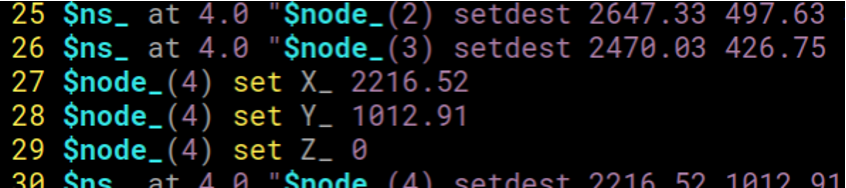
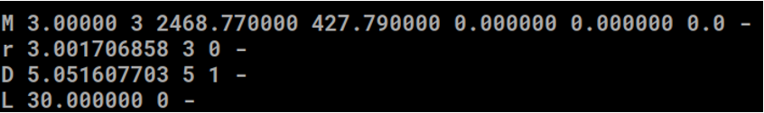

# 多跳車載網路叢集之貪婪演算法
## Multi-hop VANET-Clustering Algorithm Using Greedy Method

# 專題研究動機與目的
![]
> ## 動機
> > 各類行車輔助系統相繼出現，\
若每輛車必須提供即時行車數據給基地台，\
會造成基地台附近干擾增加，也會產生冗餘資訊，\
因此高穩定與高可靠的行車網路是必須的，\
而[1]所提出的叢集方法可有效解決此問題。
> ## 目的
> > 1. 降低整體叢集數量
> > 2. 提昇叢集平均成員數量
> > 3. 降低成員脫離叢集次數

# 實驗方法與流程
> 1. SUMO(Simulation of Urban MObility)取得行車數據
> 2. NS2(Network Simulator 2)依據行車數據生成封包傳輸資料
> 3. 依據封包傳輸資料模擬叢集運算
> 4. 輸出模擬數據，分析與比較不同叢集演算法之間的差異
> 
>  
>  

